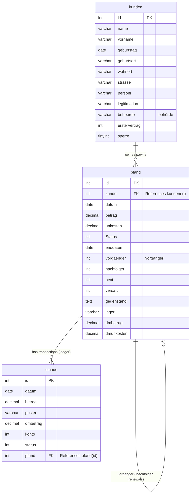

# Database Schema Diagram

Below is the Entity-Relationship (ER) diagram for the AfP Pawnshop application, illustrating the three core tables and their relationships.

### Explanation of Relationships:
- **`kunden` to `pfand` (One-to-Many):** One customer (`kunden`) can pawn multiple items or have multiple pawn tickets (`pfand`). The `kunde` column in the `pfand` table acts as the foreign key.
- **`pfand` to `einaus` (One-to-Many):** A specific pawn ticket (`pfand`) can have multiple cashbook ledger entries (`einaus`) - for example, the initial payout, fee payments, or final redemption. The `pfand` column in `einaus` links the transaction to the item.
- **`pfand` to `pfand` (One-to-One):** When a pawn ticket is extended (renewed), the legacy system points the old ticket to a new ticket using the `vorgänger` (predecessor) and `nachfolger` (successor) integer fields.
